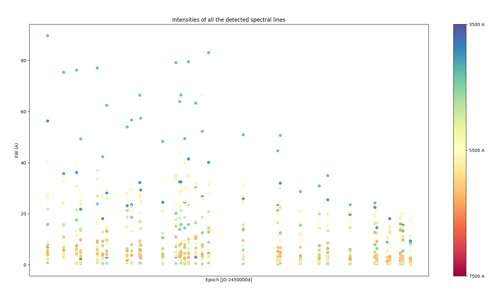

# Master thesis Marco Codato
In this repository I am going to upload daily the work on my thesis.

## Introduction and overview
I decided to manage data with Python. Since the frames are calibrated and pre-reduced, it is not necessary to use softwares like IRAF.
In the repository are present also the notes that I am writing while doing the work and can be used as a detailed report of the work and an explaination of what you can find in the script source code.

I am going to update my work daily during the week.

## Roadmap

### Done (from the latest)
- I computed equivalent widths (EWs) for some known lines. The underlying continuum is identified by performing a double median filter (analogous to the one for the bkg extraction), lines are fitted width gaussians profiles.
 Apparently lines impact in the spectrum gets lower with the time. A Possible exmplaination is the reduction of Na/Hg lamps in favour of LEDs. 
- I tried to find correlation in the bkg spectra. In particular I checked wheter the total integrated flux correlates with the position on the celestial sphere and the positions of the Moon and the Sun
 
There are no evident correlation with Sun and Moon positions (probably also due to a bat choice of params) while brightest frames seems to be those takes towars S/W direction.
- **Bkg extraction**. I wrote a script that automatically read and process all the files in a directory.
For each file a preliminary cosmic ray and noise clening is performed. After that all the astronomical sources are detected by looking at the luminosity profile along the slit (wavelength integration).
The systematic bkg trend is detected and removed to highlight acutal source peaks. These areas are removed and the remaining ones are saved in a new file, accompained with new information about the procedure in the header.

### To be done soon (in order of priority)
- Implement an efficient way to fit all the lines of the frames (now many in many cases the fit fails).
- Further investigate current results. Why a frame have around 10 times more counts than the others?
- Tune the software using more qualitative criteria

### Next steps (likely):
- Find some references in the literature about the effects of light pollution and in particular concerning spectroscopy.
- ISSUE: if we want to retrieve the sky brightness (insted of the flux only) we have to consider that observations are carried on a portion of the sky delimited by the CCD spatial size (namely the "height")
and the size of the slit. The problem is that the slit size is quite uncertain and heavily affects the precision of the computation.
- Understand how to disentangle the natural sky emission and the contribution from artificial illumination.

### Future major steps (likely):
- Decide how to model the various contributions to the bkg spectrum, in particular LED lights have very different types of spectra.
- Develope a convenient strategy to find correlation between the results of the fit and the observation conditions.
- Somehow include error propagation in the whole analysis.
